# Route Planner App

React Native ve Expo ile geliştirilmiştir.

## 🚀 Özellikler

- 📍 Kolay rota planlama
- ⏱️ Zaman tasarrufu sağlayan arayüz
- 📌 Adres kaydetme ve yönetimi
- 🎨 Modern ve kullanıcı dostu tasarım
- 🔄 Gerçek zamanlı güncelleme
- 📱 Cross-platform destek (iOS & Android)

## 📱 Ekran Görüntüleri

<div style="display: flex; gap: 10px; margin-bottom: 20px;">
  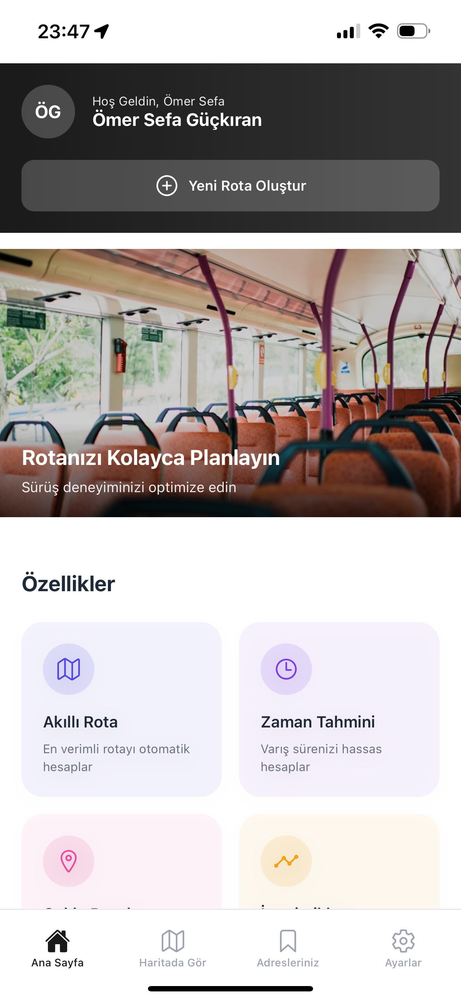
  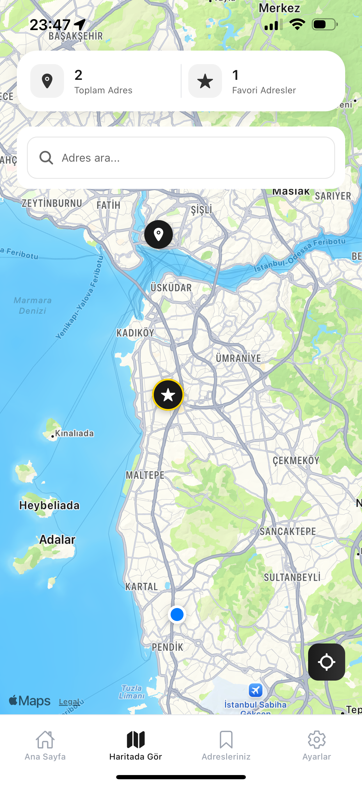
</div>

<div style="display: flex; gap: 10px; margin-bottom: 20px;">
  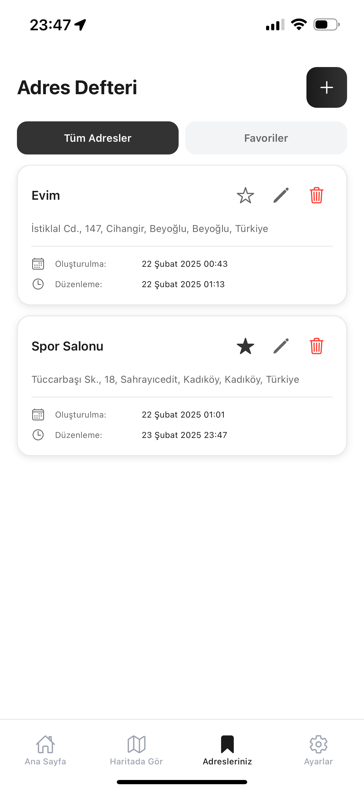
  
</div>

<div style="display: flex; gap: 10px; margin-bottom: 20px;">
  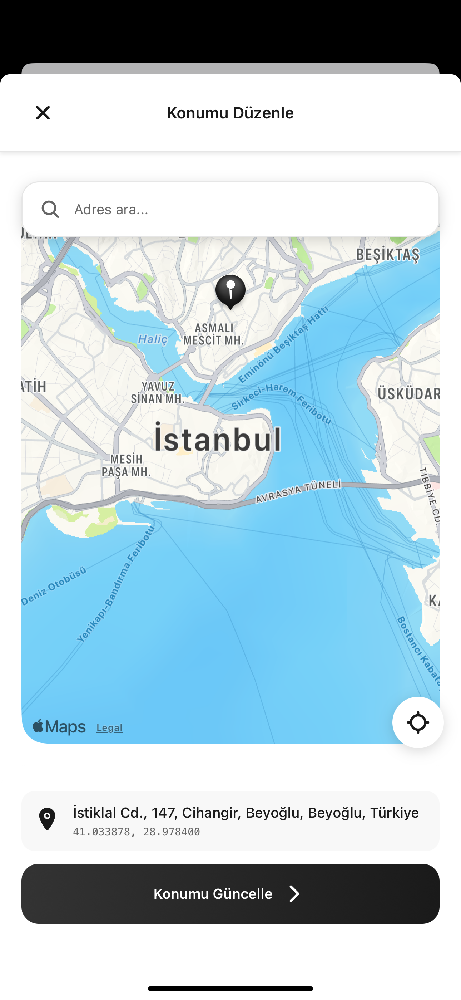
  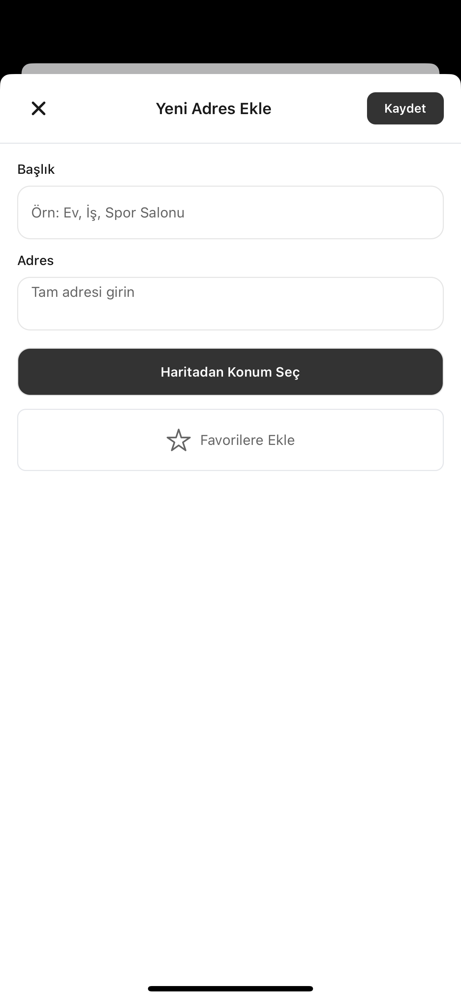
</div>

<div style="display: flex; gap: 10px; margin-bottom: 20px;">
  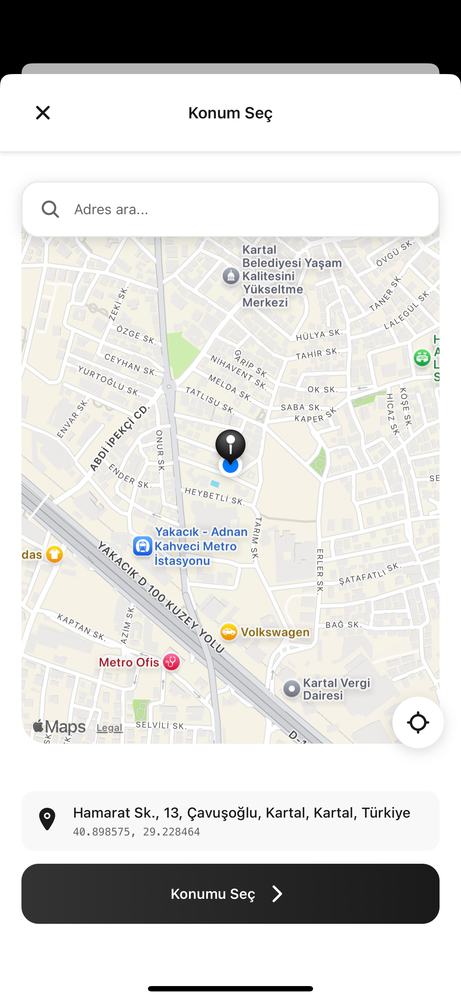
  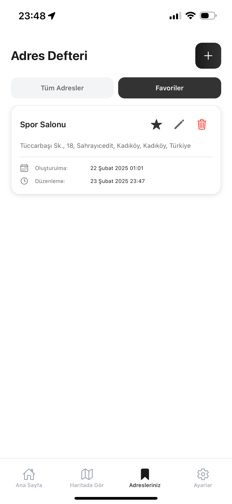
</div>

<div style="display: flex; gap: 10px; margin-bottom: 20px;">
  
  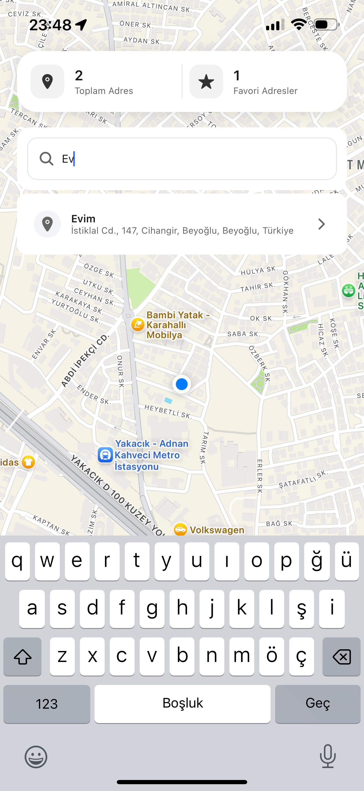
</div>

<div style="display: flex; gap: 10px; margin-bottom: 20px;">
  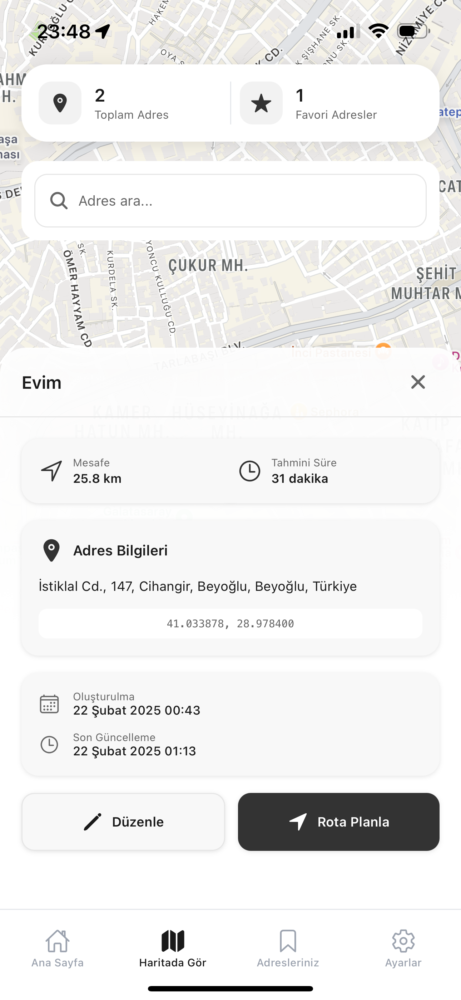
  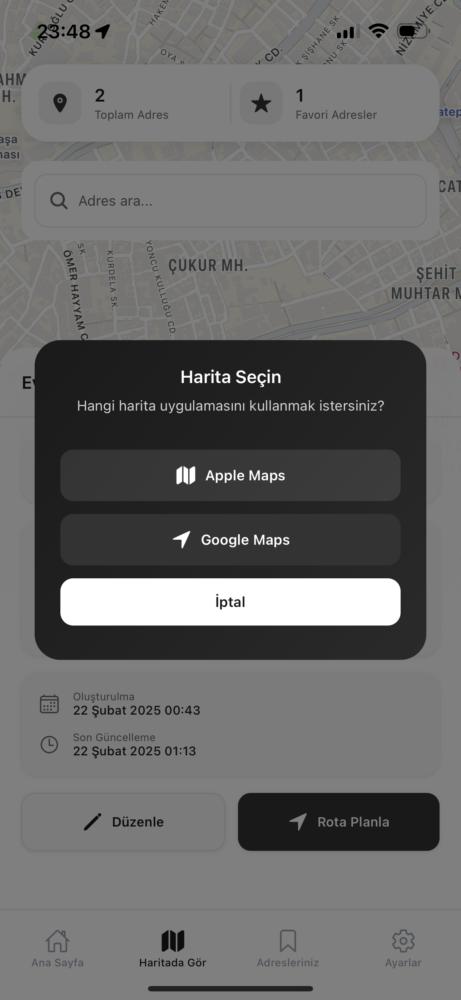
</div>

<div style="display: flex; gap: 10px; margin-bottom: 20px;">
  
  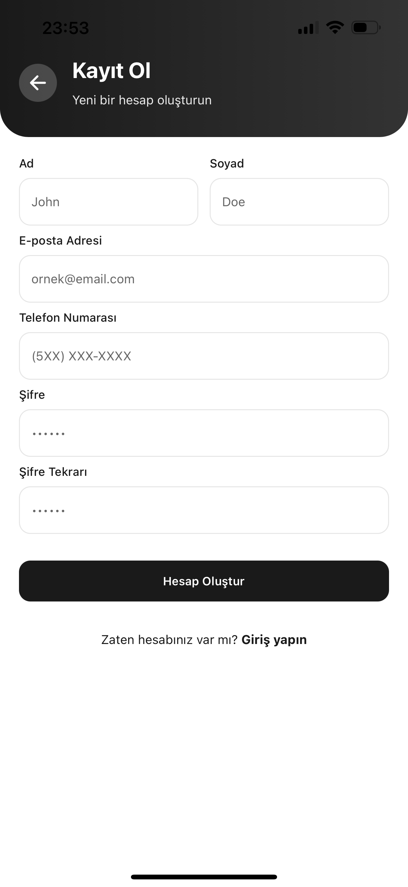
</div>

<div style="display: flex; gap: 10px; margin-bottom: 20px;">
  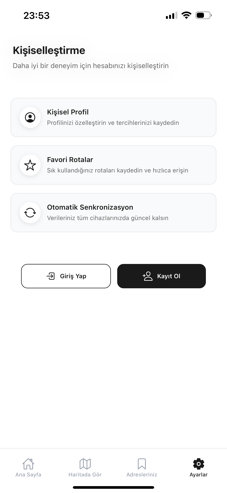
  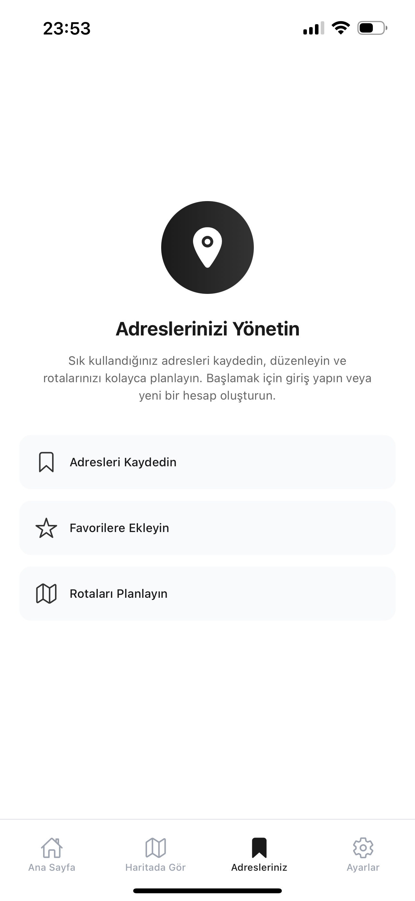
</div>

<div style="display: flex; gap: 10px; margin-bottom: 20px;">
  
  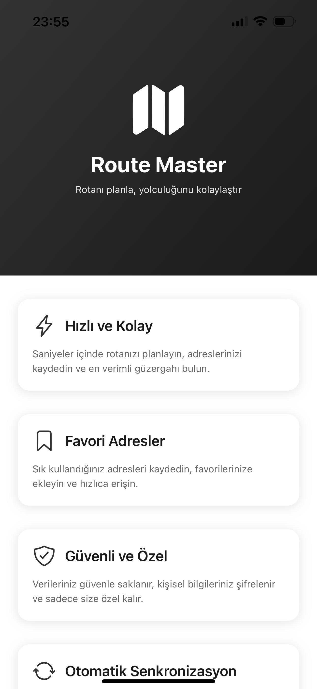
</div>

## 🛠️ Teknolojiler

- React Native
- Expo
- Redux (State yönetimi)
- React Navigation
- TypeScript
- Linear Gradient
- React Native Maps
- AsyncStorage

## 📦 Kurulum

1. Projeyi klonlayın:

```bash
git clone https://github.com/omersefagckrn/route-planner-app.git
cd route-planner-app
```

2. Bağımlılıkları yükleyin:

```bash
npm install
```

3. Geliştirme sunucusunu başlatın:

```bash
npx expo start
```

## 📱 Kullanım

1. Uygulamayı başlatın
2. Giriş ekranından "Keşfetmeye Başla" butonuna tıklayın
3. Ana ekrandan rota planlaması yapın
4. Sık kullanılan adresleri kaydedin
5. Rotalarınızı optimize edin

## 🔧 Geliştirme

Projeyi geliştirmek için:

1. Bir branch oluşturun
2. Değişikliklerinizi commit edin
3. Branch'inizi push edin
4. Pull request oluşturun

## 📄 Lisans

Bu proje MIT lisansı altında lisanslanmıştır. Daha fazla bilgi için `LICENSE` dosyasına bakın.

## 👥 Katkıda Bulunanlar

- [Ömer Sefa Güçkıran](https://github.com/omersefagckrn)

## 📞 İletişim

Sorularınız için:

- GitHub: [@omersefagckrn](https://github.com/omersefagckrn)
